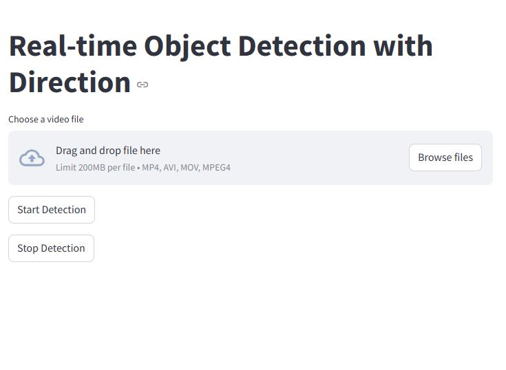

# OBJECT DETECTION WITH DIRECTION

This is a **Object detection APP** which takes in a video and gets the objects detected inside the video with their respective threshold scores.Along with the threshold scores it also gives us the direction the respective object is moving.

This repository uses Github Actions to directly push it to Huggingface Space. Before using it you must configure your repo using Huggingface Workflow yaml. Model used is Yolov8x.

### Get all the files along with the model **[HERE](https://huggingface.co/spaces/datasciencesage/object-detection-with-direction/tree/main)**

### The Webapp is Deployed using Huggingface Spaces.

**[DEPLOYED-HERE](https://datasciencesage-object-detection-with-direction.hf.space)**

### Landing Page

